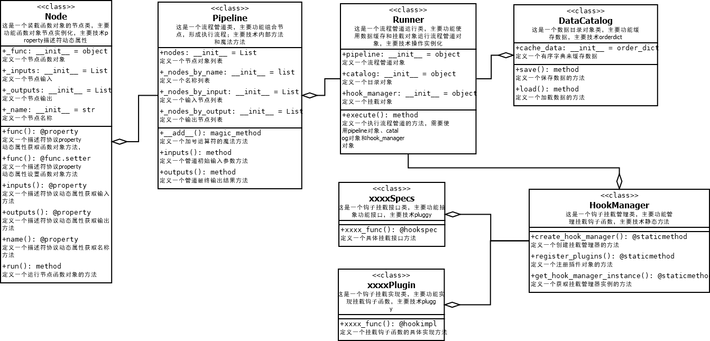

====
设计
====
	* 基于pluggy的hook技术实现灵活扩展性
	* 设计关键概念，Node，Pipeline,Runner
	* 函数节点化-Node
	* 开放挂载点-Pipeline
	* 扩展运行方式(顺序运行和并行运行)-Runner

技术列表
--------

	* property动态属性
	* 基于pluggy的hook
	* __call__
	* __add__
	* cache_dict

设计UML图
---------

以下是设计的UML图：

	